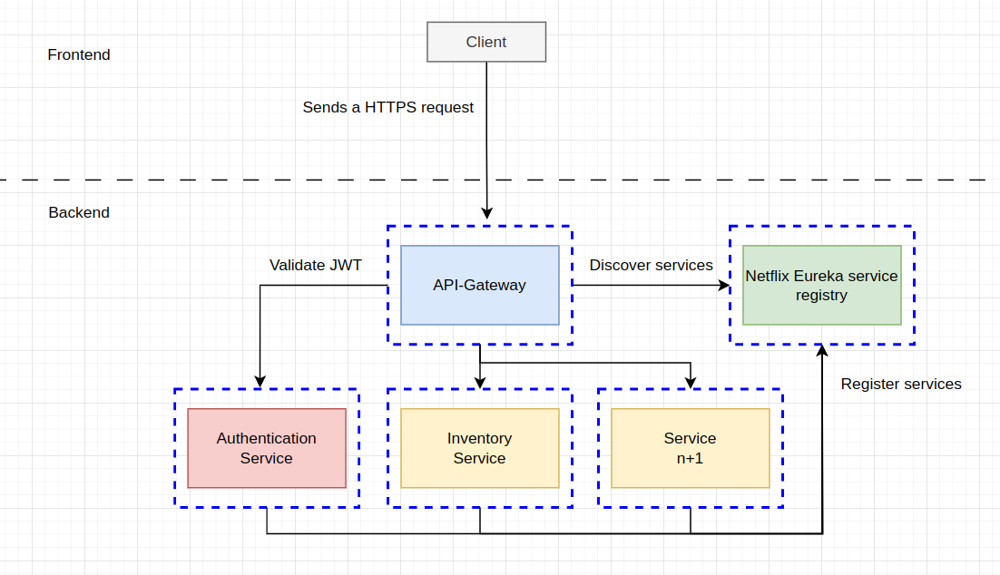

# The IMS's(Inventory Management System) backend architecture.

The architecture’s main point is to be easy to build and maintain. The microservices can be built with any programming language excluding api-gateway, authentication service and netflix-eureka-service-registry. Those are built with Java spring-boot.

Every service is containerized with docker. The application is easy to expand if more microservices are required. Every service has its own documentation. A good documentation is a must!
