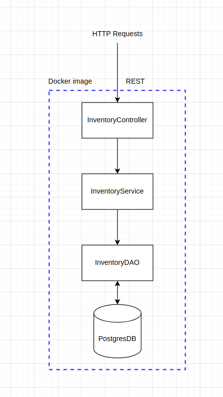

# Inventory Service architecture

Inventory service is a microservice that is running inside a docker container. This microservice is built with Java's Spring-Boot framework.

Every detail about this microservice is documented here.

## 3 Layer architecture

The architecture of this service is divided into three parts.
### Apilayer

### Business logic

### Data access

